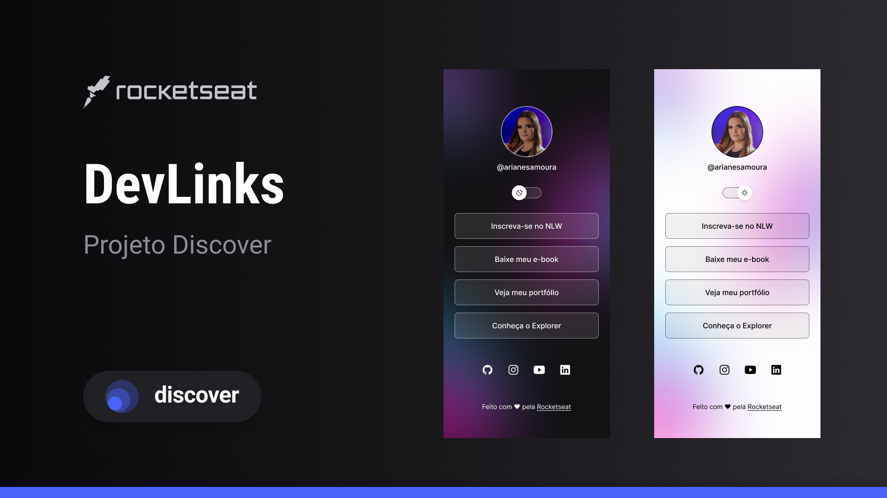

# DevLinks - Discover 

 

  

🚀 **Tecnologias:**

Esse projeto foi desenvolvido com as seguintes tecnologias:

- HTML e CSS
- JavaScript
- Git e Github
- Figma

 

🖥️ **Projeto:**

O DevLinks é um agregador de links para usar como cartão de visitas online.

 

📲 **Layout:**

Você pode visualizar o layout do projeto através [desse link](<https://www.figma.com/design/0tFE3EmMA6b9JOXyz0SlVp/DevLinks-%E2%80%A2-Projeto-Discover-(Community)?m=auto&t=PD2W7jlmqLy71YqY-6>). É necessário ter conta no [Figma](https://figma.com) para acessá-lo.

 

🌐 **Acesse o app:**

<a href="https://arianemoura.github.io/localturistico/">DevLinks</a>
